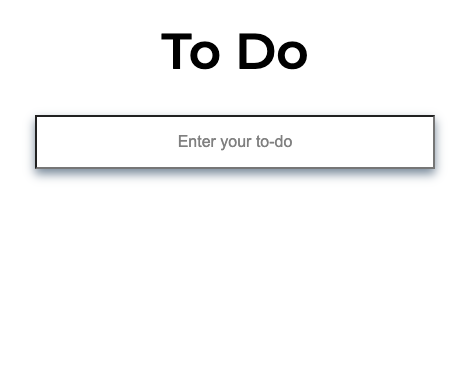
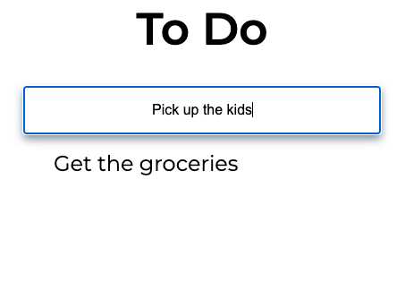
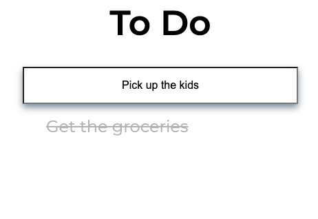

# To-Do App

A simple To-Do App that allows you to manage your tasks efficiently. This app is developed using HTML, CSS, and JavaScript. You can add items to your to-do list, mark them as done, and delete completed tasks. The entire codebase is just a little over 100 lines, making it a lightweight and easy-to-understand application. It is one of my first projects ever.


## Installation

To use the To-Do App, follow these steps:
```
1. Clone the repository or download the ZIP file.
2. Extract the files to a directory of your choice.
```
That's it! Since the app is built entirely with HTML, CSS, and JavaScript, you can run it directly in your web browser.
## Usage/Examples

1. Open the ```index.html``` file in your preferred web browser.

2. You will see an input field where you can enter your task.

3. Press the Enter key or click the "Add" button to add the task to your to-do list.

4. Your task will appear in the list below.

5. To mark a task as done, click on it once. It will be visually highlighted to indicate completion.

6. To delete a completed task, double click on it. The task will be removed from the list.
## Features

- Add tasks to your to-do list.
- Mark tasks as done.
- Delete completed tasks

## Screenshots






## Tech Stack

**Client:** HTML, CSS, JavaScript

## Authors

- [@juanedcabrera](https://www.github.com/juanedcabrera)


## License

[MIT](https://choosealicense.com/licenses/mit/)

